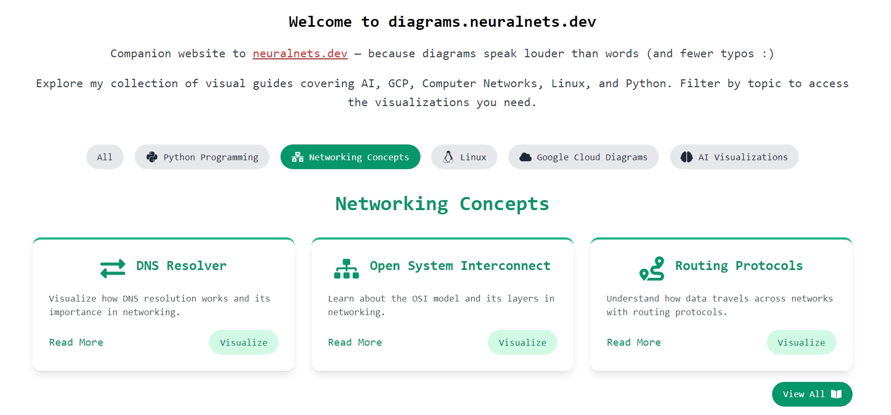

## diagrams

Welcome! This repository powers [graphil.neuralnets.dev](https://graphil.neuralnets.dev), a platform I designed to democratize technical education through sophisticated, interactive visualizations. This repository hosts meticulously crafted [react](https://react.dev/) components and HTML templates (HTML templates are generated using markmap code) to transform technical concepts into engaging and comprehensible experiences.


<p align="center">
  A screenshot of diagrams.neuralnets.dev website
</p>

### Explore the Platform 🌐

- Experience the interactive demonstrations: [diagrams.neuralnets.dev](https://diagrams.neuralnets.dev)
- Explore and test the components locally. Each component provides a modular, self-contained visualization that can be easily tested and extended.

### Core Capabilities

- **Python**: Advanced visualizations for code execution flows and data structures  
- **Linux**: Simulations of system initialization, command execution paths, and process management  
- **Networking**: Detailed representations of protocols, topologies, and data transmission  
- **Google Cloud Platform (GCP)**: Illustrations of cloud architectures and service workflows  
- **Artificial Intelligence**: Interactive visualizations of neural network architectures, training methods, and machine learning paradigms  

### Technical Foundation 🛠️

- Built using modern React principles for a modular, component-based architecture  
- Each component is self-contained and can be tested and developed independently  
- Designed with responsive methodologies for cross-device compatibility  

### Repository Structure 🗂️

```
├── Linux/         # Visualizations of system-level concepts
├── Python/        # Demonstrations of language-specific concepts
├── Networking/    # Protocol and topology visualizations
├── GCP/           # Cloud infrastructure architecture representations
├── AI/            # Visualizations of machine learning concepts
└── README.md
```

Feel free to explore and modify each component as needed. Since they are modular, you can easily extend or integrate them into your own projects. If you use any of these components, I would appreciate it if you could give credit by linking back to this repository or [diagrams.neuralnets.dev](https://diagrams.neuralnets.dev).

### Project Philosophy 🌟

This platform embodies the belief that visual comprehension accelerates understanding of complex technical concepts. It serves:  
- **Practitioners** seeking to deepen technical expertise  
- **Educators** facilitating effective knowledge transfer  
- **Professionals** documenting and architecting systems  

### Collaborative Development 🤝

Have something cool to share? Fork the repository, make your changes, and submit a pull request. Let’s learn from each other!

### Development Roadmap 🛣

Planned future enhancements include:  
- **Advanced Python Debugging Interface**: A granular visualization tool for code execution  
- **Cloud Architecture Simulation Framework**: Demonstrations of sophisticated deployment pipelines and orchestration  
- **Enhanced Linux System Visualizations**: In-depth visualizations of kernel interactions and resource allocation patterns  

### Contact 📬

Connect with me through my blog at [neuralnets.dev](https://neuralnets.dev).

---

### 📜 License: The Fine Print

This project operates under the MIT License. For more details, check the [LICENSE](LICENSE) file in the repository.  

